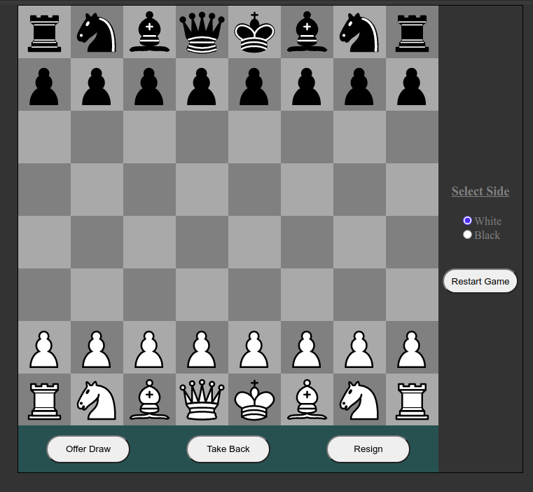
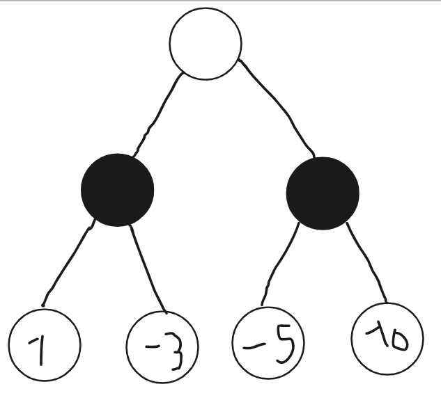
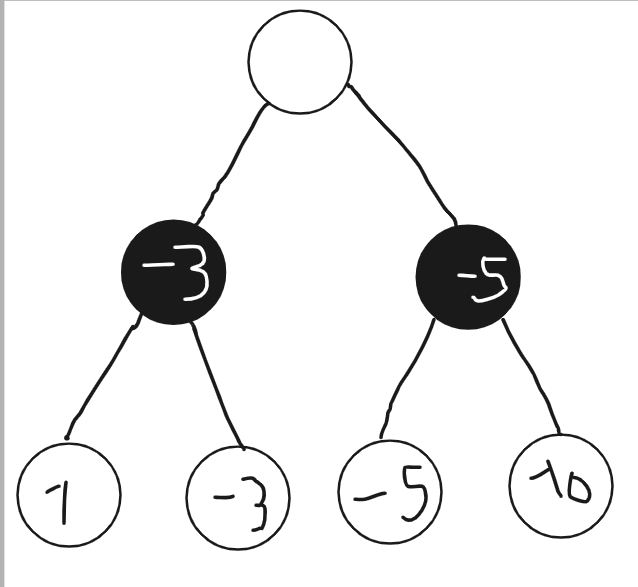
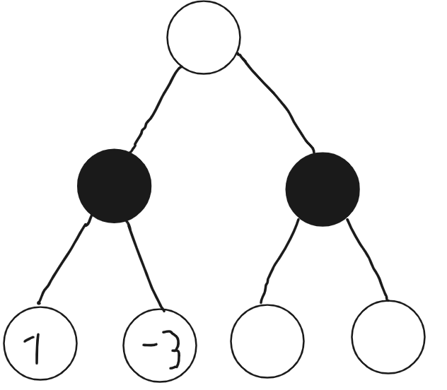
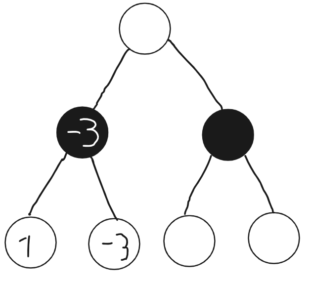
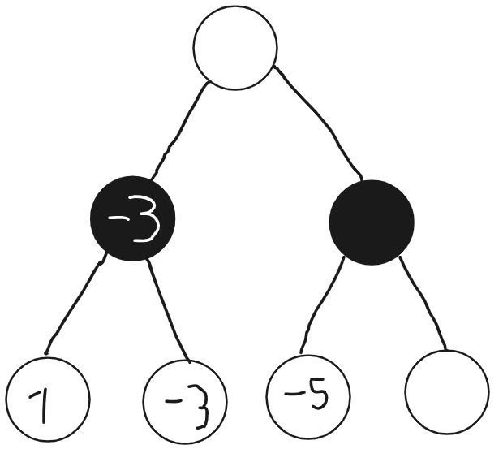
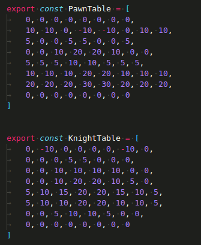
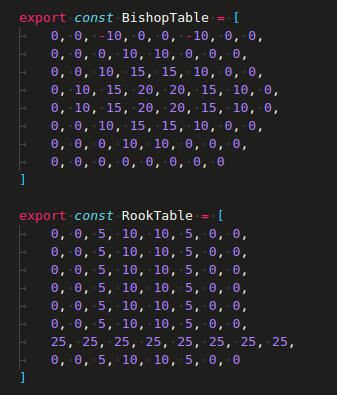

# How to run the App

First, You need to clone the image server repo that I have here: https://github.com/Srijan1214/Image-Server-Chess
 
Then run `npm start` in the server's working directory.

After the image server is running, again run `npm start` in this projects directory. 

Then go to http://localhost:3000  to view the app in your browser.

# How the AI works

The AI uses a common brute algorithm called an alpha-beta search on the
current position. But before I explain that algorithm, I will first
explain another algorithm called min-max search because it is easier to
first explain what a min-max search is before I explain how my
alpha-beta search works.

## Min-max Search

A min-max search algorithm is a brute force algorithm that simulates
playing all the legal chess moves and reaching many positions in a chess
game in a chess algorithm up till a certain depth. At the end of playing
a sequence of legal moves, the algorithm performs a static position
evaluation to see how good that final position is. This is done for all
sequence of moves.

The following describes what is done when all the end leaf nodes have
been reached and evaluated.

Let me make a dummy example in which at each position there are only two
possible moves.

Lets say it is white to move and the AI performs a mix-max algorithm.
After each move the turn to play switches. White tries to maximize the
score gotten from the child nodes while black tries to minimize.

In this position it is white's turn to move and the AI calculates two
moves deep. Let's say that the AI gives the static evaluation of the
last layer as above. In the second layer black will need to choose
between the better of 1 and -3 and the better of -5 and 10. Black will
choose -3 and -5 respectively as black is trying to minimize the score.
The scores for black in the second layer is as below.

Then white will try to maximize the score because white is trying to
make the position as good for him/herself as possible and trying to make
black's position as bad as possible. If having to choose between the
better of a score of -3 and -5, white will choose the left route of --3
from the root.

This way the algorithm decides to go left. This kind of brute force is
how the min-max search works.

## Alpha-beta Search

Alpha-beta improves the speed on the minmax while giving the same
result. Consider the following.

Let\'s say that the AI now has evaluated the two most bottom-left nodes
as above. Then since black is trying to minimize the score, the --3
route is chosen.

After this the algorithm continues to check on the right sub-tree of the
root node. Let's say the following is reached.

The node with the --5 is calculated while the rightmost node has not
been processed by the algorithm. At this point we know that black can at
least get a --5 in this position, which is better than any previously
reached node. Because of this fact, the algorithm can completely discard
the right sub-tree of the root node even before the final node is
statically evaluated because the least advantage the right sub tree
gives for black is already greater than the highest advantage the left
sub-tree has given. So, the AI chooses the same left route of --3 from
the root.

In this way alpha-beta search exponentially improves the efficiency of
mix-max while given the exact same outcome at the end.

## The Static Evaluation

After calculation some moves, the AI needs to know how good a position
is by just looking at the position. This type of function that spews out
an evaluation without any further calculation is called a static
evaluation function.

The most important part, however not sufficient by itself, in my chess
static evaluation function is the material count. The idea is that the
side with higher values pieces is better. The material count score for a
pawn is 100, bishop is 325, knight is 325, rook is 550, queen is 1000
and king is 50000. These values are very popular and even professional
human chess players use these values to get the material evaluation of
the position. The cumulative score for all the pieces is calculated for
both sides.

To supplement the material count, my chess AI also uses
piece-location-value tables to consider positional features of a chess
game. Let's look at the following picture:

  

The four arrays the PawnTable, KnightTable, BishopTable and RookTable
are all of size 64. Each of them gives the scores for a locations the
respective pieces are at. For example, if a rook is at square 4 in the
64-indexed-Board, then the piece-location-value score for that piece is
10. The piece-location-value scores for all the pieces the side has is
added to side's score. The queen uses the same table as the rook table.

This kind of table is derived from a strategy in chess which states that
the pieces in the center are more value than the pieces at the edges.
The piece-value tables enable my chess AI to implement this powerful
strategy. The strength for my chess AI is greatly increased by this.

A bishop pair bonus is also added to the evaluation function.

At the end, the opponent's score is subtracted from the current side
score to obtain the static position evaluation score.

## Quiescence Search

Just relying on the static evaluation function to get the actual
evaluation of all positions in chess is not a good idea. Many positions
in chess that will require more calculation to get the flawless
evaluation. That is how humans play chess as well. We can estimate how
good a position is by just looking at it, however, there are many
positions that we are certain needs more calculations.

This is where the idea of a quiescence search comes to play. What
happens is that at the end of the alpha-beta search, if their current
position looks volatile, then perform the alpha-beta search only for all
the capture moves a few moves deeps and get the static evaluation only
when the position settles down with no capture moves remain.

## Move Ordering

With everything mentioned up till now, the chess AI already plays a
strong game of chess. However, I can exponentially improve the speed of
the chess AI, and hence make it go much deep by implementing something
called move ordering.

The idea is that the speed of the alpha-beta search depends upon if it
stumbles upon the best variation in the initial stages. The luckiest
situation would be if the alpha-beta tree finds the best move on the
first branch. Then no other position would need to be evaluated.

Certain types of moves would have a higher probability of being the best
move. For example, a pawn capturing a queen would most likely be the
best move for the majority of positions in chess. Adding correct move
ordering strategies greatly increase the speed of the alpha-beta search
in practice.

The move ordering strategy mentioned above is called the MVVLVA (Most
valuable victim least valuable attacker) strategy. The idea is that a
low-value attacker like a pawn attacking a high-value piece like the
queen has a high likelihood of being the correct move.

Another strategy I implemented is looking at the previously thought of
best lines. For example, if the chess AI already calculated 4 moves deep
and got a certain sequence of moves as the best line found for that
depth, then that variation has a high probability of being the best
variation when calculating 5 or 6 moves deep.